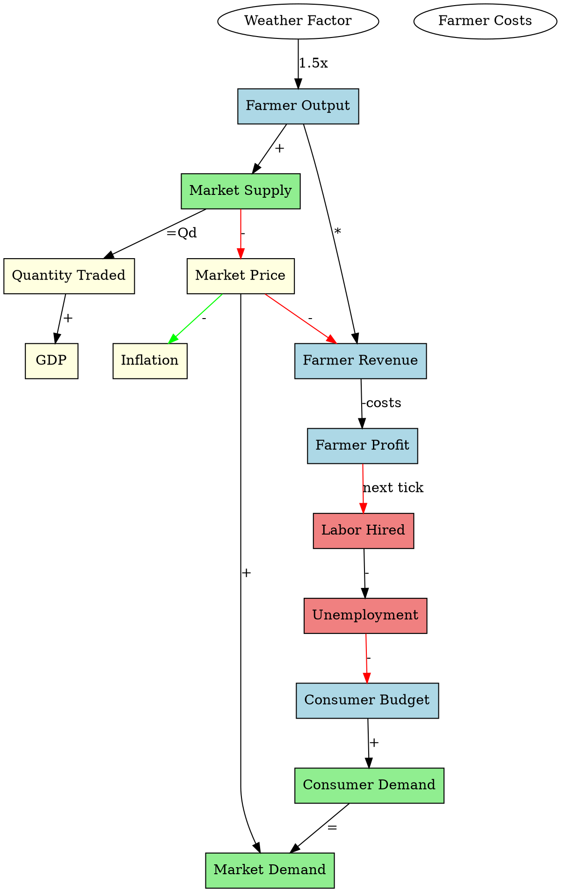

# Economic Propagation System - Visual Guide

## System Architecture Diagram

```
┌─────────────────────────────────────────────────────────────────────────────┐
│                         CPECONOMY SIMULATION                                │
│                                                                              │
│  ┌────────────────────────────────────────────────────────────────────┐   │
│  │                    SIMULATION::STEP() LOOP                         │   │
│  ├────────────────────────────────────────────────────────────────────┤   │
│  │                                                                   │   │
│  │  PHASE 1: AGENT ACTIONS (Independent Decisions)                 │   │
│  │  ├─ Farmers: Execute harvest (output_quantity changes)          │   │
│  │  ├─ Consumers: Update spending budgets                          │   │
│  │  └─ Everyone: Take autonomous actions                           │   │
│  │                ↓                                                 │   │
│  │  Queue Events: farmer.Shafin.output → 1275.0                   │   │
│  │                                                                   │   │
│  ├────────────────────────────────────────────────────────────────────┤   │
│  │  PHASE 2: MARKET CLEARING (Find Equilibrium)                    │   │
│  │  ├─ Aggregate all consumer demand at current prices             │   │
│  │  ├─ Aggregate all producer supply                               │   │
│  │  ├─ Solve: Qd = Qs → find P, Q at equilibrium                  │   │
│  │  └─ Update market prices                                        │   │
│  │                ↓                                                 │   │
│  │  Queue Events: market.Rice.price → 3.8                          │   │
│  │                                                                   │   │
│  ├────────────────────────────────────────────────────────────────────┤   │
│  │  PHASE 3: PROPAGATE EFFECTS (This is the magic!)               │   │
│  │  ├─ Tier 1: Immediate reactions (same tick)                     │   │
│  │  │  └─ market.supply ↑ → market.price ↓ → Qd ↑                │   │
│  │  ├─ Tier 2: Agent decisions (based on new info)                │   │
│  │  │  └─ farmer sees low profit → next harvest ↓                 │   │
│  │  └─ Tier 3: Delayed effects (2-3 ticks)                        │   │
│  │     └─ unemployment ↑ → demand ↓ → recession                   │   │
│  │                ↓                                                 │   │
│  │   [PROPAGATION ENGINE]                                          │   │
│  │   Applies all economic rules and cascades effects              │   │
│  │                                                                   │   │
│  ├────────────────────────────────────────────────────────────────────┤   │
│  │  PHASE 4: GOVERNMENT POLICY (Applies macro policy)             │   │
│  │  ├─ Tax collection                                              │   │
│  │  ├─ Money supply adjustment                                     │   │
│  │  ├─ Interest rate setting                                       │   │
│  │  └─ Government spending                                         │   │
│  │                ↓                                                 │   │
│  │  Queue Events: government.inflation → 0.05                      │   │
│  │                                                                   │   │
│  ├────────────────────────────────────────────────────────────────────┤   │
│  │  PHASE 5: STATISTICS (Calculate aggregates)                    │   │
│  │  ├─ GDP = C + I + G + (X-M)                                    │   │
│  │  ├─ CPI, inflation, unemployment                                │   │
│  │  ├─ Gini coefficient (inequality)                               │   │
│  │  └─ All metrics updated                                         │   │
│  │                                                                   │   │
│  └────────────────────────────────────────────────────────────────────┘   │
│                                 currentTick++                             │
└─────────────────────────────────────────────────────────────────────────────┘
```

---

## Economic Propagation Engine Detail

```
┌─────────────────────────────────────────────────────────────────────────────┐
│               ECONOMIIC_PROPAGATION ENGINE (Phase 3)                        │
├─────────────────────────────────────────────────────────────────────────────┤
│                                                                              │
│  Input: Event Queue                                                         │
│  ├─ farmer.Shafin.output_quantity: 850 → 1275                             │
│  ├─ market.Rice.price: 5.0 → 3.8                                          │
│  └─ government.income_tax_rate: 0.20 → 0.25                               │
│                                                                              │
│  ┌──────────────────────────────────────────────────────────────────────┐  │
│  │ STEP 1: Match Events to Rules                                       │  │
│  ├──────────────────────────────────────────────────────────────────────┤  │
│  │                                                                     │  │
│  │  Event: "farmer.Shafin.output_quantity" changed                    │  │
│  │    ↓                                                               │  │
│  │  Look up in rulesByTrigger["farmer.*.output_quantity"]          │  │
│  │    ↓                                                               │  │
│  │  Found 3 matching rules:                                           │  │
│  │    ├─ Rule: Supply change → Price change (IMMEDIATE)              │  │
│  │    ├─ Rule: Harvest → Revenue change (IMMEDIATE)                  │  │
│  │    └─ Rule: Profit → Labor decision (DELAYED, Tier 2)            │  │
│  │                                                                     │  │
│  └──────────────────────────────────────────────────────────────────────┘  │
│                                                                              │
│  ┌──────────────────────────────────────────────────────────────────────┐  │
│  │ STEP 2: Apply Each Rule (Filter by Tier)                           │  │
│  ├──────────────────────────────────────────────────────────────────────┤  │
│  │                                                                     │  │
│  │  ┌─ TIER 1: IMMEDIATE (delay=0, isImmediate=true)                 │  │
│  │  │                                                                 │  │
│  │  │  Rule: farmer.output_quantity ↑ 50% → market.price            │  │
│  │  │                                                                 │  │
│  │  │  Apply function:                                               │  │
│  │  │  ┌────────────────────────────────────────────────────┐        │  │
│  │  │  │ double priceElasticity = 0.3;                     │        │  │
│  │  │  │ double supplyChangeRatio = 1.5;  // 50% increase │        │  │
│  │  │  │ double newPrice = oldPrice *                      │        │  │
│  │  │  │     (1.0 - (1.5 - 1.0) * 0.3);                  │        │  │
│  │  │  │ return 5.0 * (1.0 - 0.5 * 0.3) = 4.25           │        │  │
│  │  │  └────────────────────────────────────────────────────┘        │  │
│  │  │                                                                 │  │
│  │  │  Create New Event:                                             │  │
│  │  │  market.Rice.price: 5.0 → 4.25 (propagationLevel=1)           │  │
│  │  │                                                                 │  │
│  │  │  Queue for next processing...                                  │  │
│  │  │                                                                 │  │
│  │  └─ (Continue with more IMMEDIATE rules)                          │  │
│  │                                                                     │  │
│  │  ┌─ TIER 2: AGENT DECISIONS (delay=1)                             │  │
│  │  │  ├─ farmer.Shafin.profit ↓ → farmer.Shafin.labor_hired ↓    │  │
│  │  │  ├─ market.price ↓ → consumer expectations change             │  │
│  │  │  └─ (deferred: applied next tick)                              │  │
│  │  │                                                                 │  │
│  │  └─ (Continue with more Tier 2 rules)                             │  │
│  │                                                                     │  │
│  │  ┌─ TIER 3: DELAYED EFFECTS (delay>1)                             │  │
│  │  │  ├─ unemployment ↑ → consumer.budget ↓ (2 ticks later)       │  │
│  │  │  ├─ money.supply ↑ → inflation ↑ (3 ticks later)             │  │
│  │  │  └─ (heavily deferred: affects long-term trends)              │  │
│  │  │                                                                 │  │
│  │  └─ (Continue with more Tier 3 rules)                             │  │
│  │                                                                     │  │
│  └──────────────────────────────────────────────────────────────────────┘  │
│                                                                              │
│  ┌──────────────────────────────────────────────────────────────────────┐  │
│  │ STEP 3: Update Simulation State (Apply calculated values)          │  │
│  ├──────────────────────────────────────────────────────────────────────┤  │
│  │                                                                     │  │
│  │  For each new event (market.Rice.price: 5.0 → 4.25):             │  │
│  │    ├─ Get current price in Market object                          │  │
│  │    ├─ Set new price (calls market.SetPrice(4.25))                │  │
│  │    └─ Mark as changed (for next propagation level)               │  │
│  │                                                                     │  │
│  └──────────────────────────────────────────────────────────────────────┘  │
│                                                                              │
│  ┌──────────────────────────────────────────────────────────────────────┐  │
│  │ STEP 4: Record Events (For audit trail & visualization)            │  │
│  ├──────────────────────────────────────────────────────────────────────┤  │
│  │                                                                     │  │
│  │  eventHistory.push(                                              │  │
│  │    { "farmer.Shafin.output_quantity",                             │  │
│  │      850, 1275, 1.5,                                              │  │
│  │      level=0, tick=120, "Farmer harvested" }                      │  │
│  │  );                                                                 │  │
│  │                                                                     │  │
│  │  eventHistory.push(                                              │  │
│  │    { "market.Rice.price",                                         │  │
│  │      5.0, 4.25, 0.85,                                             │  │
│  │      level=1, tick=120, "Supply increase → price drop" }          │  │
│  │  );                                                                 │  │
│  │                                                                     │  │
│  │  eventHistory.push(                                              │  │
│  │    { "consumer.*.quantity_demanded",                               │  │
│  │      200, 286, 1.43,                                              │  │
│  │      level=2, tick=120, "Price drop → demand up" }                │  │
│  │  );                                                                 │  │
│  │                                                                     │  │
│  └──────────────────────────────────────────────────────────────────────┘  │
│                                                                              │
│  Output: Updated Simulation State + Event History                          │
│  ├─ All variables have cascaded impacts                                    │
│ │ Event chain is recorded for visualization                               │
│  └─ Ready for next phase                                                   │
│                                                                              │
└─────────────────────────────────────────────────────────────────────────────┘
```

---

## Example Event Flow: "Bumper Harvest"

```
TICK 120: Farmer Shafin experiences bumper weather (1.5x)

┌─────────────────────────────────────────────────────────────────────┐
│ [PHASE 1] Farmer Action                                            │
├─────────────────────────────────────────────────────────────────────┤
│                                                                     │
│  farmer.Shafin.weather_factor  :  1.0 → 1.5                       │
│  farmer.Shafin.output_quantity :  850 → 1275 (+50%)               │
│  farmer.Shafin.revenue          :  4250 → 3825 (price falls!)     │
│  farmer.Shafin.profit           :  1000 → 325 (-67%!)             │
│                                                                     │
│  Queue Events:                                                      │
│  ❶ farmer.Shafin.output_quantity: 850 → 1275                      │
│  ❷ farmer.Shafin.revenue: 4250 → 3825                             │
│  ❸ farmer.Shafin.profit: 1000 → 325                               │
│                                                                     │
└─────────────────────────────────────────────────────────────────────┘

┌─────────────────────────────────────────────────────────────────────┐
│ [PHASE 2] Market Clearing                                          │
├─────────────────────────────────────────────────────────────────────┤
│                                                                     │
│  Aggregate Supply (Rice): 500 → 650 units (+30%)                   │
│  Aggregate Demand (Rice): 200 units (constant)                     │
│                                                                     │
│  Solve equilibrium:                                                 │
│    Old: P=5.00, Q=200                                              │
│    New: P=3.80, Q=286  (price fell 24%, demand increased 43%)     │
│                                                                     │
│  Queue Events:                                                      │
│  ❹ market.Rice.supply: 500 → 650                                   │
│  ❺ market.Rice.price: 5.00 → 3.80                                  │
│  ❻ market.Rice.quantity_demanded: 200 → 286                        │
│                                                                     │
└─────────────────────────────────────────────────────────────────────┘

┌─────────────────────────────────────────────────────────────────────┐
│ [PHASE 3a] TIER 1 Propagation (Immediate)                         │
├─────────────────────────────────────────────────────────────────────┤
│                                                                     │
│  Rule Applied #1: Price → Quantity Demanded                       │
│  ┌──────────────────────────────────────────────────────────────┐ │
│  │ Event: market.Rice.price 5.00 → 3.80                        │ │
│  │ Apply Rule: Price elasticity = -0.8                         │ │
│  │   Change ratio: 3.80/5.00 = 0.76 (24% decrease)            │ │
│  │   ΔQd = 200 * (1 + (0.76-1.0) * (-0.8))                   │ │
│  │   ΔQd = 200 * (1 + 0.24 * 0.8) = 200 * 1.192 = 238.4     │ │
│  │ New quantity demanded: 240 units                            │ │
│  └──────────────────────────────────────────────────────────────┘ │
│                                                                     │
│  Queue Event:                                                       │
│  ❼ consumer.rice.quantity_demanded: → 240                          │
│                                                                     │
│  (Continue with other Tier 1 rules...)                             │
│                                                                     │
└─────────────────────────────────────────────────────────────────────┘

┌─────────────────────────────────────────────────────────────────────┐
│ [PHASE 3b] TIER 2 Propagation (Agent Decisions)                   │
├─────────────────────────────────────────────────────────────────────┤
│                                                                     │
│  Rule Applied #2: Low Profit → Reduce Labor                       │
│  ┌──────────────────────────────────────────────────────────────┐ │
│  │ Event: farmer.Shafin.profit 1000 → 325 (-67%)             │ │
│  │ Now in Tier 2: farmer makes decisions                      │ │
│  │   Profit fell to 32.5% of original!                        │ │
│  │   Decision: "Can't afford to hire next season"             │ │
│  │   labor_hired: 10 → 7  (-30%)    [Will take effect next]  │ │
│  │ (This happens in next Step, not this tick)                 │ │
│  │ Strength = 0.6, Delay = 1                                  │ │
│  └──────────────────────────────────────────────────────────────┘ │
│                                                                     │
│  Queue Event:                                                       │
│  ❽ farmer.Shafin.labor_hired: 10 → 7 (deferred to next tick)      │
│                                                                     │
│  (Continue with other Tier 2 rules...)                             │
│                                                                     │
└─────────────────────────────────────────────────────────────────────┘

┌─────────────────────────────────────────────────────────────────────┐
│ [PHASE 3c] TIER 3 Propagation (Delayed/Systemic)                  │
├─────────────────────────────────────────────────────────────────────┤
│                                                                     │
│  (No immediate Tier 3 effects from THIS event)                     │
│  (If we had processed unemployment ↑, this would cascade)          │
│                                                                     │
└─────────────────────────────────────────────────────────────────────┘

┌─────────────────────────────────────────────────────────────────────┐
│ [PHASE 4] Government Policy                                        │
├─────────────────────────────────────────────────────────────────────┤
│                                                                     │
│  (No special gov response to bumper harvest in this model)         │
│  (Could add: subsidy reduction if welfare improves)                │
│                                                                     │
└─────────────────────────────────────────────────────────────────────┘

┌─────────────────────────────────────────────────────────────────────┐
│ [PHASE 5] Statistics Update                                        │
├─────────────────────────────────────────────────────────────────────┤
│                                                                     │
│  GDP: 5250 → 5738 (+9.3%, due to increased output)                │
│  CPI: 102.0 → 98.9 (-3.0%, due to falling prices = deflation!)   │
│  Farmer Shafin's wealth: (profit fell = worse off despite more Q) │
│  Consumer welfare: (can pay less, demand more = better off)        │
│                                                                     │
└─────────────────────────────────────────────────────────────────────┘

┌─────────────────────────────────────────────────────────────────────┐
│ TICK 121: Next Step Begins                                         │
├─────────────────────────────────────────────────────────────────────┤
│                                                                     │
│  [PHASE 1] New Actions:                                            │
│    farmer.Shafin.labor_hired: 10 → 7                               │
│    (The deferred decision from last tick is NOW applied)           │
│    Result: Farmer hires fewer workers                              │
│    Those 3 workers become unemployed!                              │
│                                                                     │
│  [PHASE 3] New Propagation:                                        │
│    unemployment ↑ → consumer.*.wallet ↓ → demand ↓                 │
│    (The downward spiral continues,  triggered by bumper harvest!)  │
│                                                                     │
└─────────────────────────────────────────────────────────────────────┘
```

---

## Dependency Graph Visualization (Graphviz)

The system can export to `.dot` file for visualization:



When rendered, this creates a visual map showing:
- How bumper harvest (weather) propagates through entire economy
- The negative feedback loop: harvest → low price → low profit → unemployment
- How unemployment reduces demand, completing the cycle

This can be viewed with: `dot -Tpng economy.dot -o economy.png`

---

## Key Takeaways

1. **Every variable can affect many others** - No isolated variables
2. **Effects cascade through tiers** - Immediate → Decisions → Systemic
3. **Time delays matter** - Some effects take several ticks to manifest
4. **Feedback loops emerge** - Bumper harvest can cause recession!
5. **Everything is traceable** - Can see exactly why any variable changed
6. **Extensible** - Add new rules without rewriting core simulation
